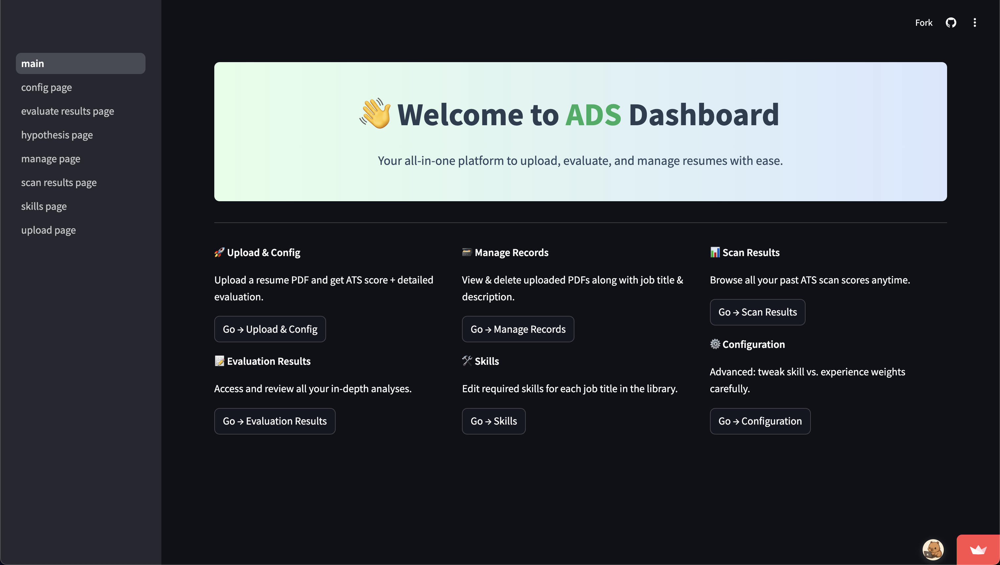
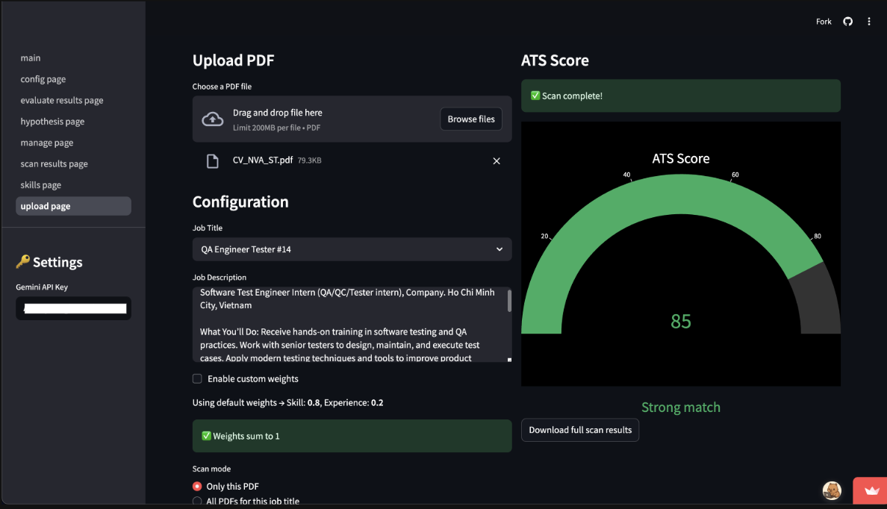

# ADS App

## Introduction

ADS Dashboard is a Streamlit-powered, an application that lets hiring teams upload and securely store PDF resumes, configure custom skill-vs-experience weightings, and instantly generate ATS-style scores alongside rich, per-candidate analyses (keyword matches, fuzzy skill detection, experience summaries, word counts and more). Its intuitive sidebar navigation also provides quick access to historical scan results, detailed evaluation reports, resume management (view, download or delete), a centralized skill library for each job title, and advanced configuration settings—everything you need to streamline, standardize and scale your CV screening process.

Link demo: [ADS app](https://capigiba.streamlit.app/)





## Prerequisites

- **Python 3.8+**
- **Git** (optional, for cloning the repository)
- Recommended: **virtualenv** or **venv** for isolated environments

## Setup

1. **Clone the repository** (if using Git):
   ```bash
   git clone <repository_url>
   cd folder
   ```
   If you already have the project files locally, simply `cd` into the project folder:
   ```bash
   cd /path/to/folder
   ```

2. **Create and activate a virtual environment**:
   ```bash
   python3 -m venv .venv
   source .venv/bin/activate   # macOS/Linux
   .\.venv\Scripts\activate  # Windows
   ```

3. **Install dependencies**:
   If a `requirements.txt` is provided:
   ```bash
   pip install -r requirements.txt
   ```
   Otherwise, install manually:
   ```bash
   pip install streamlit pandas
   ```

## Usage

1. **Start the Streamlit app**:
   ```bash
   streamlit run main.py
   ```

2. **Open in browser**:
   By default, Streamlit runs on `http://localhost:8501`. Your terminal will show the exact URL.

3. **Navigate between pages**:
   - **Upload**: Upload a new PDF and configure job-related weights.
   - **Manage**: View all uploaded records, preview PDFs, and soft-delete entries.
   - **Jobs**: Add, view, and edit job titles used in the upload form.

## Notes

- Uploaded PDFs are stored in `folder_pdf` with filenames generated by `utils/file_utils.py`.
- Soft-deleted records are marked in `records.csv` with `status = deleted` but the row remains for audit.
- Timestamps (`created_at` and `updated_at`) use ISO format.


